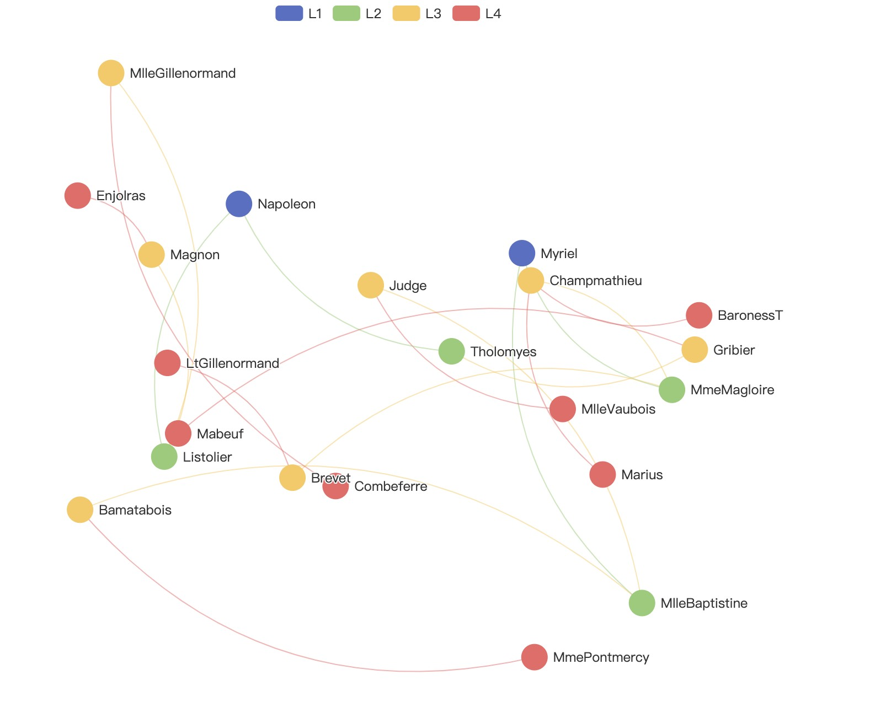

# Echarts Config Generator

Generate [echarts](https://echarts.apache.org/en/index.html) graph config

```
L1	L2	L3	L4
Myriel	MlleBaptistine	Bamatabois	MmePontmercy
Myriel	MlleBaptistine	Judge	MlleVaubois
Myriel	MmeMagloire	Brevet	LtGillenormand
Myriel	MmeMagloire	Champmathieu	Marius
Myriel	MmeMagloire	Champmathieu	BaronessT
Napoleon	Tholomyes	Gribier	Mabeuf
Napoleon	Listolier	Magnon	Enjolras
Napoleon	Listolier	MlleGillenormand	Combeferre
```



## TODO

- [ ] Add a button to copy the config to clipboard
